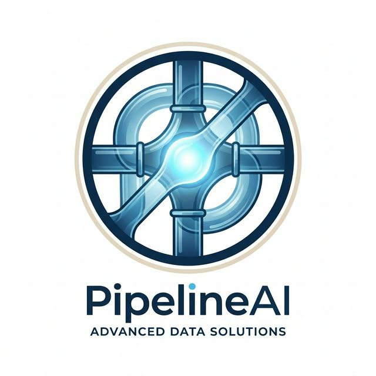

<p align="center">
  
</p>

# 🚀 PipelineAI: Real-Time Predictive CI/CD Intelligence

**Predict failures, don't just observe them.**

PipelineAI is a predictive developer-experience layer designed for modern software engineering teams. It bridges the gap between code commits and pipeline execution by identifying high-risk changes *before* they are pushed, saving developer time, cloud compute costs, and energy.

---

### 🔥 Core Features
*   **Provider-Agnostic Core**: Built-in support for multiple Version Control Systems (VCS) including **GitLab**, **GitHub**, and **Bitbucket**.
*   **Real-Time Risk Gauge**: Instantly see the probability of build failure based on 7 behavioral signals.
*   **Explainable AI (XAI)**: Integrated **SHAP** feature importance charts that show *why* the AI is predicting a failure (e.g., Code Churn, Midnight Factor).
*   **AI Mentor**: Sophisticated, Claude-powered refactoring advice to mitigate risks.
*   **🌱 Sustainability Tracker**: Real-time monitoring of CO₂ emissions prevented by avoiding failed cycles.
*   **Enterprise Dashboard**: Centralized monitoring of system health, high-risk trends, and audit logs.

---

### 💻 Local Setup
1. **Clone & Install**:
   ```bash
   python -m pip install -r backend/requirements.txt
   cd frontend && npm install
   ```
2. **Launch Developer Mode**:
   - Backend: `python backend/main.py` (Port 8000)
   - Frontend: `npm start` (Port 3000)
3. **Magic Demo Toggle**: Navigate to `http://localhost:3000/dashboard?demo=high` to see the high-risk predictive model in action with full mock data.

---

### 🏗️ Technology Stack
*   **Intelligence**: Scikit-Learn (Random Forest), SHAP (XAI), Anthropic Claude
*   **Architecture**: FastAPI (Python), Create React App (Material-UI)
*   **Deployment**: Support for Docker, Render, Vercel, and Google Cloud Run.
*   **Data Science**: Pandas, Joblib, SQLAlchemy (SQLite/Postgres)

---

### 🛡️ Security & Compliance
*   **RBAC**: Role-Based Access Control for Developer, Analyst, and Admin tiers.
*   **Audit Logging**: Every prediction and system event is tracked for compliance.
*   **Data Privacy**: All behavioral data is processed with encryption at rest.

---
**Build Smarter. Push Greener. This is PipelineAI.**
